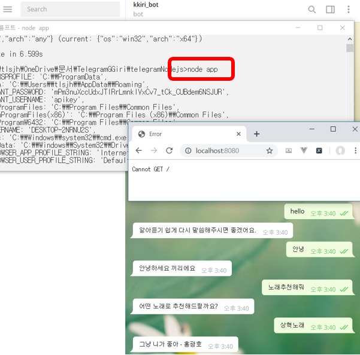

# TelegramGGiri

Basic example of how to integrate your Watson chatbot with Telegram app.

### Steps on Telegram app: 

#### 1. First, open your Telegram app, and tap on search button, type `@BotFather`.

#### 2. Send a `/newbot` command message and:
  - Enter your the name of your Chatbot
  - Enter your Username:
        * E.g: `WatsonChat<anyOtherNames>Bot` (Replace `<anyOtherNames>` with whatever you would like to)
        
#### 3. Once created, the `@BotFather` will give you an `TOKEN`, *save it*
  
  
### Steps for using the repo:

#### 1. Clone the repository or download it
  
#### 2. Rename the env.example for `.env`, add your `TOKEN` & Watson Assistant credentials.
  - Token is the code generated by @BotFather in your conversation on Telegram. (Check in `@BotFather` conversation)

#### 3. Run the command `npm install --save` and the required packages will be installed: 
   - dotenv
   - express
   - ibm-watson
   - node-telegram-bot-api
   - eslint

#### 4. Run the command `node app` to start your server!
   - `Use localhost:8080 on the browser to check if the server is working`
   
#### 5. Time of testing your bot!
 - Open your Telegram app, tap _search_, and type your bot `username` that you have created. (You can also check in `@BotFather` conversation)
 - Try to sent a message!

### 완성본



```
$ npm install --save
$ node app
```

1. localhost:8080 에 로컬 서버가 켜지고
2. 텔레그램의 kkiri_bot에서 끼리 봇 이용 가능

###### This code is based on [Conversation-Telegram](https://github.com/sayurimizuguchi/conversation-telegram/) example.
